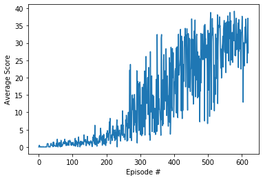

# Project 2 - Continuous Control Report
## Payam Mousavi

## Learning Algorithm

Following the suggested algorithms I selected DDPG (with a replay buffer). I experimented a little with different
hyperparameter values in the configuration file. The results appear to be highly sensitive to the choice of the random
number seed! In practice, to gauge the performance reliably, a more thorough hyperparameter search is needed. For the 
purposes of this project, I just picked a combination that met the minimum requirements. Interestingly I noticed that
decreasing the number of neurons in each hidden layer improved the performance (i.e., slower convergence)

*Hyperparameters*:

- For both actor and critic networks: 2 hidden layers: (256, 128)
- Memory batch-size: 256
- Buffer-size: 1E6
- Update frequency: 5
- Learning rates:
    - Actor: 1e-4 
    - Critic: 3e-4 for critic
- discount rate: 0.98
- No weight decay
- Ornstein-Uhlenbeck noise - Used as done in the Udacity Github repo.

Full list of hyperparameters could be found in the file `config.py`

## Performance
A plot of average scores vs. episode numbers is shown below:

The environment was solved in 620 episodes. A single NVIDIA GTX1080 GPU was used for training. The training took 
approximately an hour. 

## Future Work

- A more thorough hyperparameter search
- The training should be done for multiple random number generator seeds. I found extreme sensitivity to this.
- Try different algorithms: PPO for example
- Try a shared network for the two agents.

